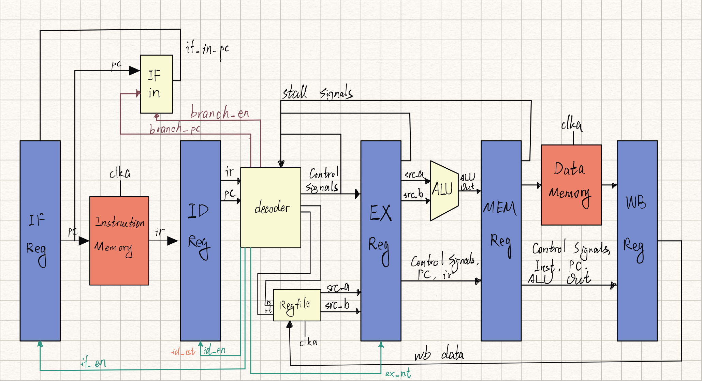
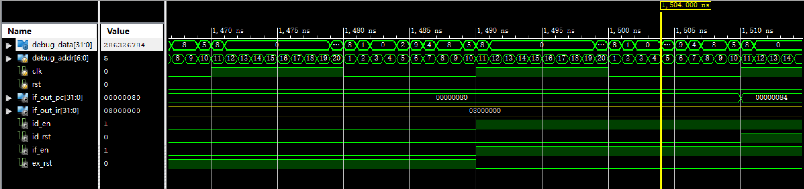
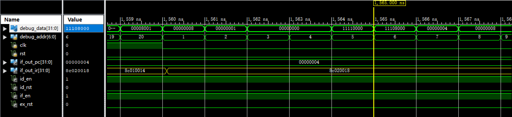
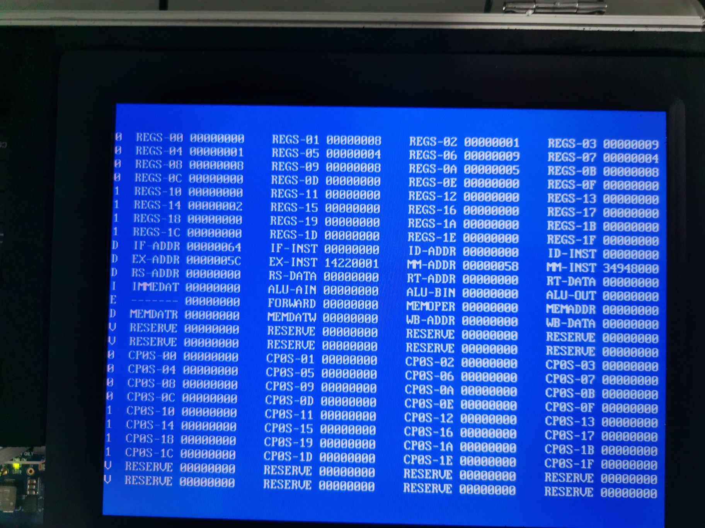
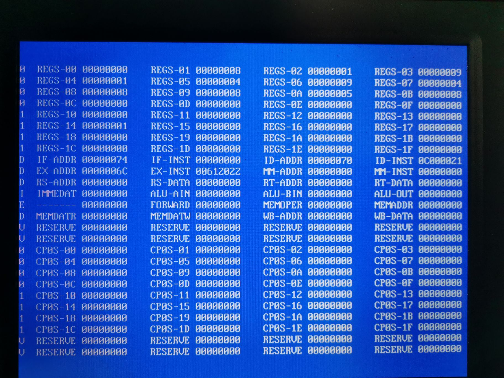
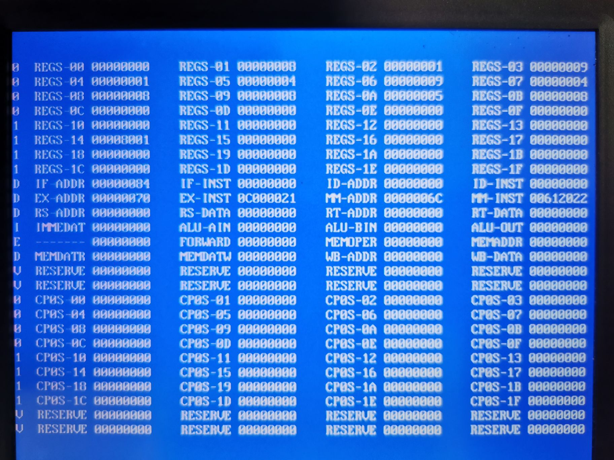
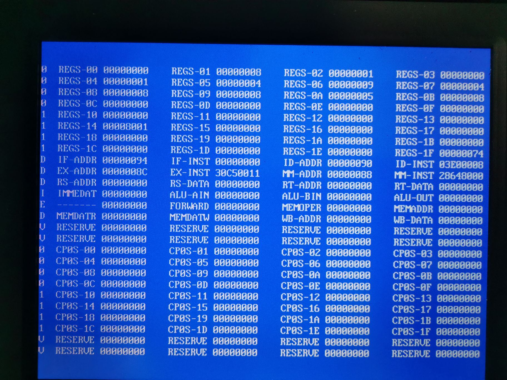
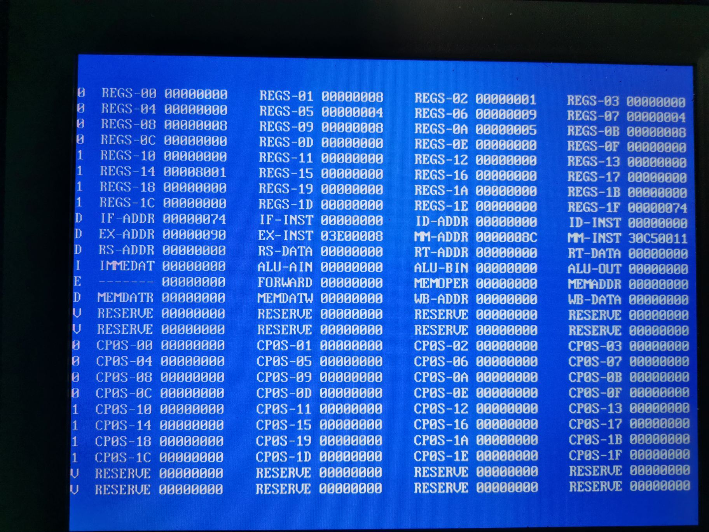
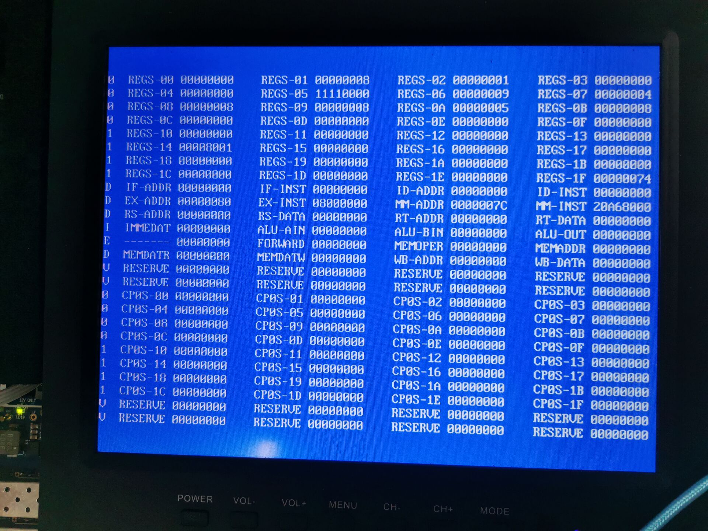

 


<center><b>浙江大学实验报告</b>


课程名称：  计算机体系结构          实验类型： 综合    

实验项目名称： 实验 3-2 - 流水线 CPU 设计：暂停与冒险                    

学生姓名：臧可        专业：计算机科学与技术      学号：3180102095           

同组学生姓名： None            指导老师：常瑞    

实验地点：曹光彪西楼301                 实验日期：  2020年   12月  2日

## 一、 实验目的

- 完善流水线的基本功能，实现流水线暂停机制。

- 深入理解流水线冒险，掌握利用 stall 处理流水线冒险，保证流水功能正确性的基本技

  术。

- 理解 stall 产生的弊端，尝试思考改进的方案。

## 二、主要实验工具

- **HDL**：Verilog

- **IDE**：ISE

- **开发板**：Sword 4 

## 三、实验步骤与要求

### **3.1** 实验要求

在 Lab 3-1 的基础上，增加 stall 机制以处理分支跳转以及，要求能够顺利运行 Lab3-2.s。

指令要求同 Lab 3-1。

MIPS 指令扩展要求：add, sub, and, or, xor, nor, slt, sra, jr, jalr, addi, andi, ori, xori, lui, lw, sw, beq, bne, slti, srai, j, jal。（23 条指令）

### **3.2** 实验步骤

1. 使用开发工具建立工程，推荐在 Vivado 2019.2 以上版本使用 System Verilog 完成。
2. 在 Lab 3-1 流水线 CPU 基础上实现 stall 机制。注：继续使用 SWORD 4 或 NEXYSA7 对应的外设进行实验。
3. 进行仿真测试，以检验 CPU 基本功能。
4. 调整时钟频率，确保时钟周期长度不小于最长流水段的信号延迟。
5. 进行上板测试，以检验 CPU 设计规范，上板测试调试工具相关内容请参考 Lab1。

## 四、 实验过程和数据记录及结果分析

### 4.1 实验原理图



**特点:** 在decoder内进行分支跳转和stall的判断.

从ID, EX, MEM Reg分别读入写寄存器信号和当前写寄存器, 在decoder中和当前流水中需要用到的寄存器进行比较, 如果冲突输出if_en, id_en和ex_rst在id和exe阶段插入stall. 

如果从ID阶段读入branch跳转信号, decoder输出id_en在if和id阶段插入stall, 确保branch之后的指令不会被执行.

### 4.2 关键代码

在decoder中判断是否需要stall和输出信号的代码.

```verilog
	//pipeline control
	reg reg_stall;
	reg branch_stall;
	
	always @(*) begin
		reg_stall = 0;
		//rs
		if(require_rs && rs != 0)begin
			if ((wd_exe == rs) && wb_wen_exe) begin
				reg_stall = 1;
			end
			else if ((wd_mem == rs) && wb_wen_mem) begin
				reg_stall = 1;
			end
            else if ((reg_exe == store[11:2]) && mem_w_exe) begin
				reg_stall = 1;
			end
		end
		 //rt
		if((require_rt || mem_w)&& rt != 0)begin//sw use rt but src_b is not rt
			if((wd_exe == rt) && wb_wen_exe)begin
				reg_stall = 1;
			end
			else if ((wd_mem == rt) && wb_wen_mem) begin
				reg_stall = 1;
			end
		end
	end

	always @(*) begin
		branch_stall = 0;
		if(branch_id)
			branch_stall =1;
	end

	always @(*)begin
		if_en = 1;
		id_en = 1;
		id_rst = 0;
		ex_rst = 0;
		if(reg_stall)begin
			if_en = 0;
			id_en = 0;
			ex_rst = 1;
		end
		//this stall indicate that a jump/branch instruction is running, so 1 NOP should be inserted between IF and ID
		else if(branch_stall)begin
			id_rst = 1;
		end
	end
```

#### reg_stall解决RAW冲突

如果当前需要读取rs, rt对应的寄存器, 可能产生RAW冲突(sw需要用到rt, rs, 但是因为是rs和simm进行加法运算, require_rt为0, 所以单独加一个判断信号mem_w)

当前rs或rt和exe, mem阶段写目标寄存器重复且该阶段写寄存器信号为1(lw, r-type, i-type) , reg_stall置一

当前rs+simm(store, lw指令读取的mem寄存器)和exe阶段的写入memory寄存器一样的时候, reg_stall置一

reg_stall置一的时候, if_en, id_en置零, 保持当前ir和pc不变, ex_rst置一清空ex阶段的ir, pc和控制信号, 防止计算出错误数据写回.

#### branch_stall解决跳转指令封闭

设计的流水线在id阶段即可进行跳转地址和跳转信号的判断, 所以只需要加入一个id_rst清空跳转指令下一拍读入的指令, 防止其继续执行.

### 4.3 仿真验证

#### 仿真代码

```verilog
integer i;
	initial begin
		// Initialize Inputs
		debug_en = 0;
		debug_step = 0;
		// debug_addr = 1;
		clk = 0;
		rst = 0;
		interrupter = 0;

		#100 rst = 1;
		#100 rst = 0;
		
		
	end

	initial begin
		fork
			forever #10 clk = ~clk;
			forever #0 begin
				for(i = 0; i < 20; i = i + 1) begin
					debug_addr = i+1;
					#1;
				end
			end
		join
	end
```

因为测试代码涉及到R1~R20的寄存器值, 所以在每个时钟周期循环显示这20个寄存器的值.

#### 仿真结果


.asm的第九行执行完, R1~R6寄存器值如图所示, 分别为4,1,5,1,4,(5->9), 正确


.asm的第15行执行完, R1~R11寄存器值如图所示, 分别为4,1,5,1,4,9,4,8,8,4,8, 正确


.asm的第16行执行完, R1~R11寄存器值如图所示, R10寄存器值变为8


.asm的第17行执行完, R1~R11寄存器值如图所示, R10寄存器值变为5


.asm的第25行执行完, R1~R11寄存器值如图所示, 分别为8,1,9,1,4,9,4,8,8,5,8, R20的寄存为(2->32769即0x8001), 正确


.asm的最后一行执行完, R1~R11寄存器值如图所示, 分别为8,1,0,0,1,9,4,8,8,5,8, R20的寄存为32769即0x8001, 正确



jr跳转到jal后一行, R1~R11寄存器值如图所示, 分别为8,1,0,0,(2->286326784即0x11110000),9,4,5,8, R20的寄存为32769即0x8001, 正确



到j begin, R6寄存器变成11108000, 此时pc已经跳转回初始地址, 正确

### 4.4 测试结果


.asm的第九行执行完, R1~R6寄存器值如图所示, 分别为4,1,5,1,4,(5->9), 正确


.asm的第17行执行完, R1~R11寄存器值如图所示, 分别为4,1,5,1,4,9,4,8,8,(4->8->5),8, 正确





.asm的第25行执行完, R1~R11寄存器值如图所示, 分别为8,1,9,1,4,9,4,8,8,5,8, R20的寄存为(2->0x8001), 正确



pc从74跳转到84, bne判断正确





pc从94跳转到74, jr跳转正确


.asm的最后一行执行完, R1~R11寄存器值如图所示, 分别为8,1,0,0,1,9,4,8,8,5,8, R20的寄存为0x8001, 正确




j begin跳回pc=0, R6寄存器在pc=4时变成11108000, 此时j begin之前的指令都已经正确执行完毕,

## 五、 思考题

1. ###### 为什么在本实验中，关于冲突只需考虑 RAW 就可以了？请对你了解的各种常见的冲突进行分析，尤其说明在什么情况下是不能被忽视，需要特殊处理。

   因为本实验中的指令是按顺序执行的, 只有RAW可能会在前一条指令还没有写入的时候读取, 产生错误数据. WAW和WAR在指令顺序执行的时候结果永远是符合逻辑的, 所以不需要处理冲突, 在乱序执行的时候最后写回寄存器的值的顺序可能会和初始代码逻辑冲突, 需要特殊处理. 需要更改寄存器名, 或者增加限制条件让WB必须按指令读入的顺序执行.

2. ###### 如果 EX、MEM、WB 段中不止一个段中的写寄存器指令与 ID 段指令发生了 RAW 冲突，你将该如何处理？

   用if-else把所有情况都考虑到, 只要当前有一个冲突流水线就进入stall, 不会进行下一条指令的执行. 本实验中的流水线已经解决了这些冲突.

## 六、心得

1. 本次实验做了很久, 一开始主要原因是没有弄清时钟周期, 在读写mem和存入regfile阶段采用和各个流水阶段寄存器一样在时钟周期上升沿读入, 导致错拍. 后来在舍友的提醒下修改了时钟周期, 在上升沿进行五段流水寄存器的更新, 在下降沿进行mem数据的读取和regfile的写入, 不再出现错拍的问题.
2. 一开始写stall的时候没有考虑lw和sw的冲突, 导致部分结果不太正确. debug后添加了lw和sw阶段关于mem寄存器读写冲突的判断, 解决了这一问题
3. 因为lab3-1实验的时候, 对于sw指令, src_a需要rs, src_b需要sim, require_rt置零, 实际上sw指令需要读取rt的指令, 但是require_rt不可以置一否则会影响src_b的判断. 所以最后选择在reg_stall(rt)的判断条件单独里添加mem_w
4. 一开始对于reg_stall的输出控制信号没有考虑ex_rst, 所以尽管不再读取新的指令了, 原来读到exe阶段的指令仍然会继续执行, 此时读读取的仍然是未更新的寄存器值, 导致结果出错. 增加了ex_rst的控制信号令exe阶段的指令和信号全部置零后解决了问题
5. 通过本次实验, 关于流水线和stall的理解更加深刻具体了.